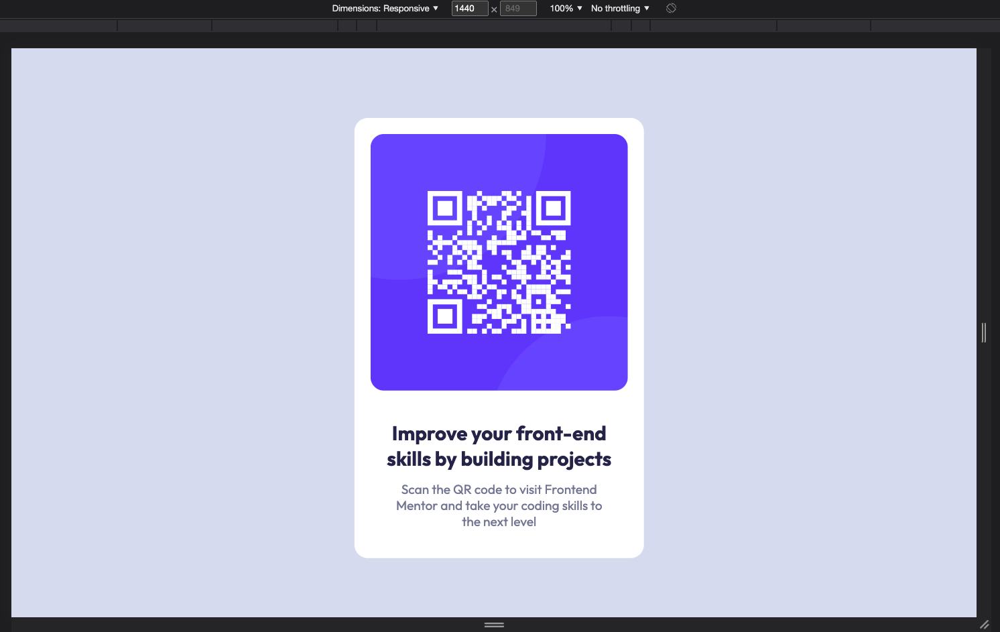
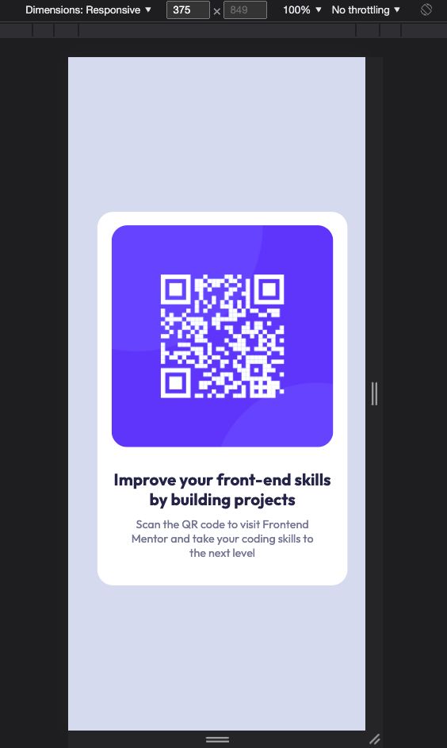

# Frontend Mentor - QR code component solution

This is a solution to the [QR code component challenge on Frontend Mentor](https://www.frontendmentor.io/challenges/qr-code-component-iux_sIO_H). Frontend Mentor challenges help you improve your coding skills by building realistic projects. 

## Table of contents

- [Frontend Mentor - QR code component solution](#frontend-mentor---qr-code-component-solution)
  - [Table of contents](#table-of-contents)
  - [Overview](#overview)
    - [Screenshot](#screenshot)
    - [Links](#links)
  - [My process](#my-process)
    - [Built with](#built-with)
    - [What I learned](#what-i-learned)
    - [Continued development](#continued-development)
    - [Useful resources](#useful-resources)
  - [Author](#author)

## Overview
My solution for the QR code web project on Frontend Mentor

### Screenshot

### Links

- GitHub repo: 

## My process

### Built with

- Semantic HTML5 markup
- CSS custom properties
- Flexbox
- Vite
- [React](https://reactjs.org/) - JS library

### What I learned

I practiced using a lot of css properties, particularly media queries to make the design work adequately for both Desktop and Mobile.

### Continued development

I would love to learn more and use css grid. Although I didn't use it in this project (I used flexbox) I know it is an interesting tool that I'd like to learn more about.

### Useful resources

- [CSS Queries](https://www.w3schools.com/css/css3_mediaqueries.asp) - This is a great resource to refresh my memoty on css media queries syntax.

## Author

- Frontend Mentor - [@mariela-plaza](https://www.frontendmentor.io/profile/mariela-plaza)

